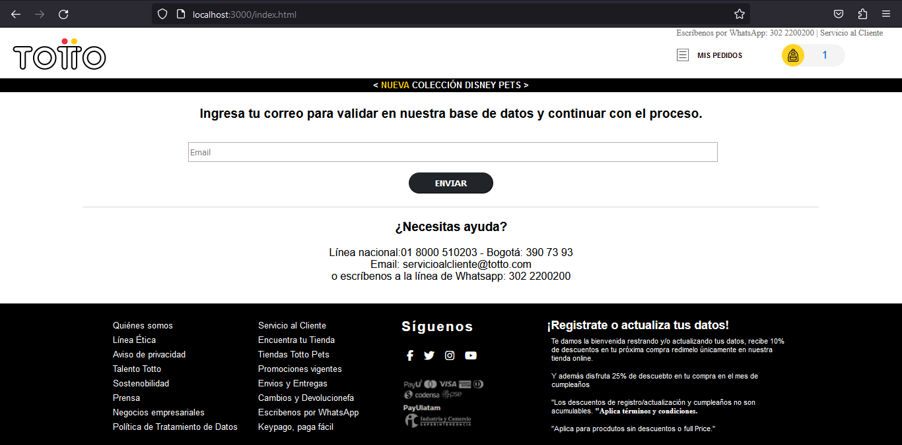
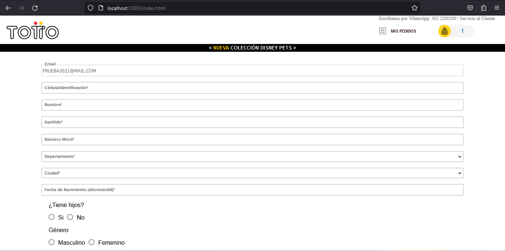

# README - Single Page Application (SPA)

## Description

This project implements a Single Page Application (SPA) that uses HTML5, JavaScript, PHP and Node.js technologies. The SPA allows users to register, update information and validate their registration through an interactive form.

## Used technology

 -) HTML5: Basic structure and semantic markup.

-) JavaScript: Client-side field validation.

-) PHP: Connection with the MySQL database and creation of microservices.

-) Node.js: Automating tasks with Gulp or Grunt and compiling SASS.

## System caracteristics
User Registration and Validation

-) The user enters their email.

-) The system validates if the user is registered on the page.

## Registration Form

-) If the user is not registered, they are presented with a form to complete.

-) The "Department" field triggers the appearance of another select with related cities.

## Updating of information

-) If the user is already registered, the form fields will be prefilled with their existing information.

-) The user can only update the date of birth, with the following restrictions:

-) The date cannot correspond to the current month.

   -) Only one update is allowed.

## For local processes
- Turn on node service with npm start
- Press SCSS services npm run watch:scss

## PHP Microservices

    curl --location 'http://localhost/singelPageToto/public/index.php?ruta=validation-email' \
    --header 'Content-Type: application/json' \
    --data-raw '{
        "email": "correo@ejemplo.com"
    }'

## Create or Update Record

    curl --location 'http://localhost/singelPageToto/public/index.php?ruta=update-user' \
    --header 'Content-Type: application/json' \
    --data-raw '{
        "email_update_or_cerate": "prueba@ejemplo.com",
        "document": "123456",
        "name": "Nombre",
        "surname": "Apellido",
        "cellphone": "123456789",
        "department": "1",
        "city": "1",
        "birthday": "1990-01-01",
        "he_has_children": "0",
        "gender": "F",
        "number_updates": 0,
        "tyc_update": "on",
        "data_treatment": "on"
    }'

## Installation and configuration

- Download the repository.

- Configure MySQL database and update connection details in PHP code.

- Run the PHP server.

- Run the Node.js server for Gulp or Grunt.

- Access the SPA through the browser.

## Additional notes
- Make sure you have all dependencies installed.

- Customize and adjust the code according to the specific needs of your application.